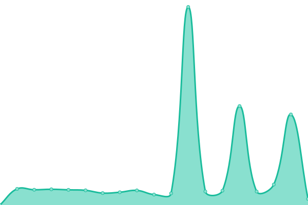
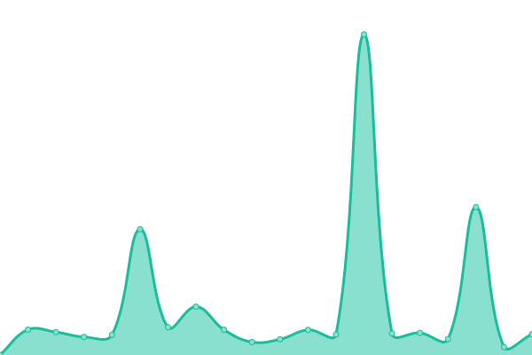
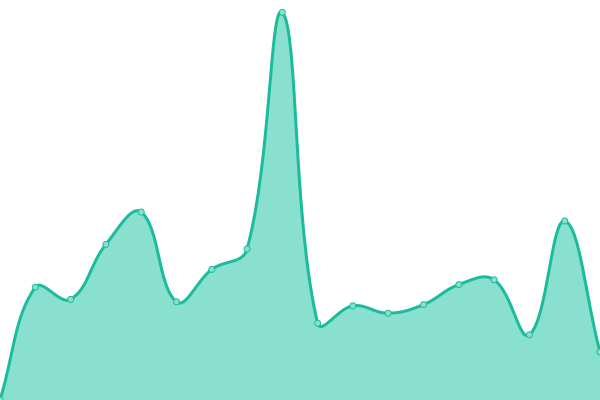

# [📈 Live Status](https://tathaha.github.io): <!--live status--> **🟥 Complete outage**

This repository contains the open-source uptime monitor and status page for [Chiraitori](https://tathaha.github.io), powered by [Upptime](https://github.com/upptime/upptime).

With [Upptime](https://upptime.js.org), you can get your own unlimited and free uptime monitor and status page, powered entirely by a GitHub repository. We use [Issues](https://github.com/tathaha/uptimes/issues) as incident reports, [Actions](https://github.com/tathaha/uptimes/actions) as uptime monitors, and [Pages](https://tathaha.github.io) for the status page.

<!--start: status pages-->
<!-- This summary is generated by Upptime (https://github.com/upptime/upptime) -->
<!-- Do not edit this manually, your changes will be overwritten -->
<!-- prettier-ignore -->
| URL | Status | History | Response Time | Uptime |
| --- | ------ | ------- | ------------- | ------ |
|  [Angermusic Bot](https://www.angermusic.ga) | 🟥 Down | [angermusic-bot.yml](https://github.com/tathaha/bruhuptime/commits/HEAD/history/angermusic-bot.yml) | 

 0ms
     
 | 

<a href="https://tathaha.github.io/history/angermusic-bot">0.00%</a>
    

|  [uptimekumma](https://second.animeuptime.ml) | 🟥 Down | [uptimekumma.yml](https://github.com/tathaha/bruhuptime/commits/HEAD/history/uptimekumma.yml) | 

 0ms
     
 | 

<a href="https://tathaha.github.io/history/uptimekumma">0.00%</a>
    

|  [Lavalink](https://lava.chirailava.tk/metrics) | 🟥 Down | [lavalink.yml](https://github.com/tathaha/bruhuptime/commits/HEAD/history/lavalink.yml) | 

 0ms
     
 | 

<a href="https://tathaha.github.io/history/lavalink">0.00%</a>
    

|  [Lavalink Backup](https://lava2.chirailava.tk/metrics) | 🟥 Down | [lavalink-backup.yml](https://github.com/tathaha/bruhuptime/commits/HEAD/history/lavalink-backup.yml) | 

 0ms
     
 | 

<a href="https://tathaha.github.io/history/lavalink-backup">0.00%</a>
    

<!--end: status pages-->

[**Visit our status website →**](https://tathaha.github.io)

## 📄 License

- Powered by: [Upptime](https://github.com/upptime/upptime)
- Code: [MIT](./LICENSE) © [Chiraitori](https://tathaha.github.io)
- Data in the `./history` directory: [Open Database License](https://opendatacommons.org/licenses/odbl/1-0/)
